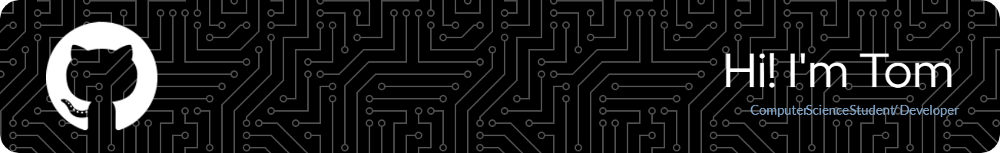

<i>"Just because something doesn’t do what you planned it to do doesn’t mean it’s useless." - Thomas Edison</i>

<h2 align="center"> About Me </h2>

 :gb: 19 year old student / developer from the United Kingdom

 🎓 Currently completing a Level 6 Digital and Technological Solutions Degree Apprenticeship 

 💻 Avid tech enthusiast 

👨‍💻 Developing an automated Tech Deals Bot for Discord 

🤖 Freelance Discord Bot Developer, currently working on 3Bs 

<h4 align="center"><i> I like to keep a lot of my work private (especially my more recent repos) as my clients would not like their work open-source</i></h4>

<h2 align="center"> Languages and Tools </h2>

<h4 align="center"> I'm Confident With </h4>

<h4 align="center"> I'm Learning </h4>

<h4 align="center"> I Intend to Learn </h4>

<h2 align="center"> My Setup </h2>

<h4 align="center"> PC </h4>

<h4 align="center"> Other </h4>

  
<h2 align="center"> GitHub Stats </h2>

 

